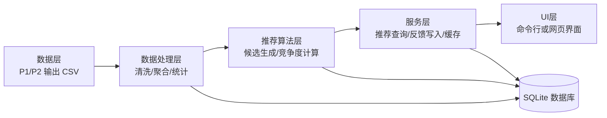

# 第三阶段系统架构设计（v1）

## 1. 架构目标

第三阶段的核心不是把功能堆起来，而是把“算法实验”变成“可运行系统”。因此采用离线/在线分离的架构：离线阶段负责重计算，在线阶段负责快速查询。

## 2. 总体结构

## 3. 分层职责

### 3.1 数据层

来源于前两阶段的 CSV 文件：

- `seed_keywords_v1.csv`（P1 阶段人工整理的控制种子表，15 个 seed，包含 domain / reason / owner 字段）
- `tokenized_queries_v1.csv`
- `word_freq_v1.csv`
- `seed_related_queries_v1.csv`

其中，`seed_keywords_v1.csv` 不是从日志自动抽取出来的结果，而是项目预先定义的 seed 集合，用来驱动离线统计、推荐排序和横向评估，保证实验口径一致。

### 3.2 数据处理层

- 读取离线结果并做聚合。
- 生成中介关键词统计。
- 生成竞争候选词统计。

### 3.3 推荐算法层

- 根据 seed 聚合 token 频次。
- 根据全局词频修正权重。
- 计算竞争度并排序。

### 3.4 服务层

- 提供 `recommend(seed, top_n)`。
- 提供 `record_feedback(...)`。
- 提供缓存机制，减少重复查询。

### 3.5 UI层

- 第三阶段先以 CLI 为主，验证流程。
- 第四阶段再接入网页或桌面界面。

## 4. 在线与离线分离

### 4.1 离线阶段

离线阶段做重计算：

1. 导入关键词表。
2. 聚合 seed 的中介关键词。
3. 计算候选竞争词与分值。
4. 批量写入数据库。

### 4.2 在线阶段

在线阶段只做轻操作：

1. 接收输入。
2. 检查缓存。
3. 查询数据库。
4. 输出 Top-N。
5. 记录日志和反馈。

## 5. 性能设计逻辑

### 5.1 为什么要离线化

如果把分词、统计、排序都放到在线链路，每次查询都会重新扫描大量历史数据，响应时间会迅速变差。离线化的本质是把大计算提前做完，把复杂度从用户请求路径上移走。

### 5.2 为什么要缓存

热门 seed 的请求会重复出现。缓存命中后，系统可以直接从内存返回结果，避免重复 SQL 和重复排序。

### 5.3 为什么要建索引

推荐系统的在线瓶颈通常在查询而不是计算。对 `seed_keyword`、`candidate_keyword` 建索引后，查询路径会明显稳定。

## 6. 系统边界

本阶段只实现：

- 数据库结构
- 离线导入骨架
- 在线查询服务骨架
- 性能基准脚本

不在第三阶段强行追求复杂 UI，以免把工程重点带偏。

## 7. 与实验要求的对应关系

第三阶段 3.3 要求的四项内容，本系统都已经覆盖：

- **软件系统概述**：见 `SRS_v1.md` 与 `reports/p3_final_summary.md`。
- **软件系统结构设计**：见本文档的分层结构与离线/在线分离设计。
- **功能模块设计**：见 `module_design_v1.md`。
- **数据库设计**：见 `db_schema_v1.sql` 与 `db_dictionary_v1.csv`。

因此，本阶段的 benchmark 与横向对比不是“额外偏题内容”，而是用来证明上述系统设计在真实数据上可运行、可比较、可扩展的支撑材料。
