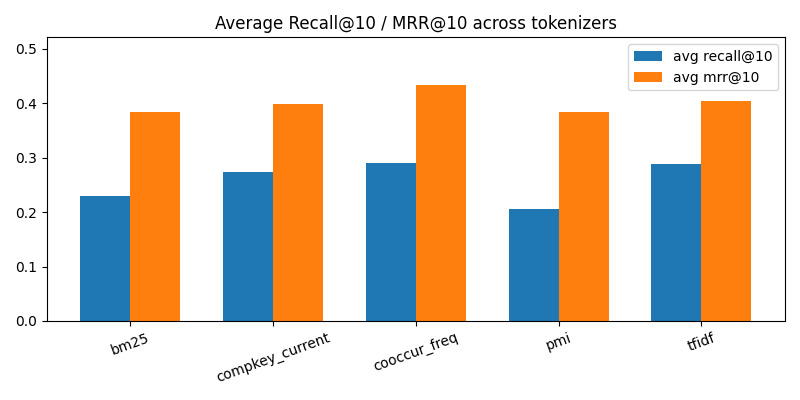
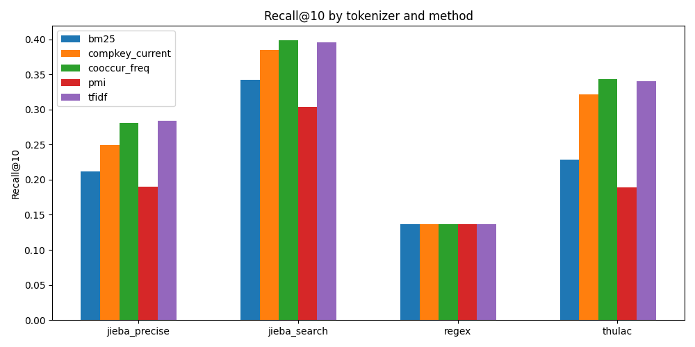
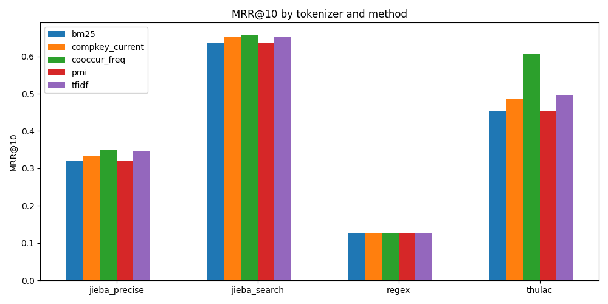
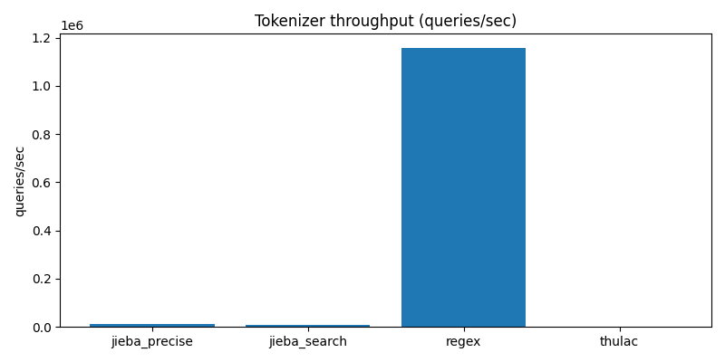
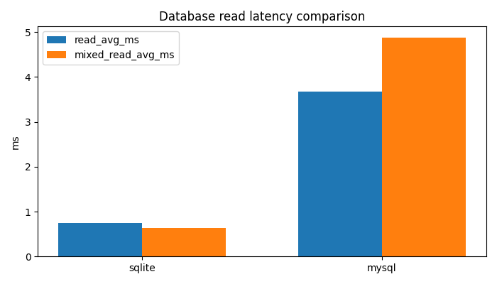
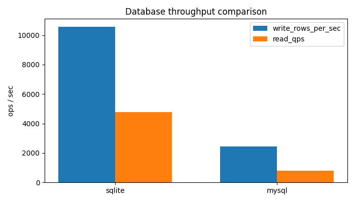
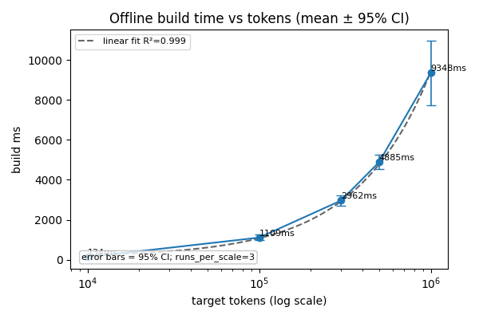

# P3 横向对比总汇总（结构整理版）

本文档把 P3 里已经完成并且带有**真实数值**的横向对比统一收拢到一处，包含：

- 多方法候选/排序基线对比（`compkey_current` / `cooccur_freq` / `tfidf` / `pmi` / `BM25`）
- Tokenizer 对比（`jieba_precise` / `jieba_search` / `regex` / `thulac`）
- 数据库横向对比（SQLite vs MySQL）
- 大规模扩展测试（100k / 1M token）
- 对应的图表与脚本入口

为了让 P3 文件夹更清楚，建议你以后优先从下面几个入口看：

## 0. P3 目录导航

- `deliverables/P3/README.md`：P3 目录结构说明
- `deliverables/P3/reports/README.md`：reports 目录索引
- `deliverables/P3/reports/p3_methods_horizontal_compare.md`：本总汇总文档（主入口）
- `deliverables/P3/reports/p3_final_summary.md`：最终摘要

---

## 1. 本轮已完成的横向对比总览

| 横向对比 | 对比对象 | 关键指标 | 结论摘要 |
|---|---|---|---|
| 候选/排序基线 | `compkey_current` / `cooccur_freq` / `tfidf` / `pmi` / `BM25` | Recall@10、MRR@10、无缓存平均延时 | `tfidf` 的 Recall@10 最好，`cooccur_freq` 的 MRR@10 最好，`BM25` 是稳定的强检索基线 |
| Tokenizer | `jieba_precise` / `jieba_search` / `regex` / `thulac` | queries/sec、tokens/sec、avg tokens/query、Recall@10、MRR@10 | `jieba_search` 在方法评测里整体最强，`thulac` 次之，`regex` 最快但最粗糙 |
| 数据库 | SQLite / MySQL | init_ms、import_ms、read_avg_ms、write_rows_per_sec、mixed latency | 本机小规模场景 SQLite 更快；MySQL 初始化和导入更慢，但更适合后续并发扩展 |
| 扩展性 | 100k / 1M token | 离线构建耗时（mean ± std, 95%CI，runs_per_scale=3） | 构建时间随规模明显上升；1M token 约 9.35s（mean over 3 runs，见 5.1 与附表） |

---

## 2. 候选/排序基线横向对比

### 2.1 方法说明

- `compkey_current`：项目当前方案。基于 seed 内 token 的局部支持度 `local_share`、稀有性 `rarity` 和支持度对数放大项形成竞争分数。
- `cooccur_freq`：最简单的共现频次基线，只按支持次数排序。
- `tfidf`：TF-IDF 风格打分，强调区分性 token，抑制高频通用词。
- `pmi`：点互信息，强调强关联，但对低频更敏感。
- `BM25`：经典检索强基线，考虑词频饱和和长度归一，是目前最值得保留的对照方法之一。

### 2.2 平均结果（跨 tokenizer 的方法汇总）

下面是把 `p3_multimethod_tokenizer_compare.csv` 按方法做跨 tokenizer 平均后的结果：

| method | avg_recall@10 | avg_mrr@10 | avg_no_cache_ms |
|---|---:|---:|---:|
| bm25 | 0.229731 | 0.383313 | 0.149702 |
| compkey_current | 0.273078 | 0.399017 | 0.097368 |
| cooccur_freq | 0.289980 | 0.434518 | 0.086595 |
| pmi | 0.204965 | 0.383313 | 0.097653 |
| tfidf | 0.289195 | 0.404023 | 0.093508 |

### 2.3 平均结果图

### 2.4 结论

- 如果优先看**召回**，`tfidf` 和 `cooccur_freq` 都是最强梯队，`tfidf` 更偏向覆盖，`cooccur_freq` 更偏向把命中的候选排前。
- 如果优先看**排序前列命中**，`cooccur_freq` 的平均 MRR@10 最好。
- `BM25` 在这份数据上没有超过 `tfidf` / `cooccur_freq`，但它是非常标准、可解释且值得保留的强基线。
- `compkey_current` 维持了项目原有的可解释规则，但在本次样本上不是最优。
- `pmi` 在低频和稀疏条件下较容易波动，因此作为单独基线时表现偏弱。

### 2.5 原始逐 tokenizer 结果表

下面是每个 tokenizer 下的真实运行结果，便于直接核对具体数据：

| tokenizer | method | eval_queries | recall@5 | recall@10 | mrr@10 | coverage@10 | avg_latency_no_cache_ms | avg_latency_cache_ms |
|---|---|---:|---:|---:|---:|---:|---:|---:|
| jieba_precise | compkey_current | 53 | 0.213134 | 0.249298 | 0.333753 | 1.000000 | 0.082406 | 0.008085 |
| jieba_precise | cooccur_freq | 53 | 0.246153 | 0.280744 | 0.349079 | 1.000000 | 0.090232 | 0.006302 |
| jieba_precise | tfidf | 53 | 0.232002 | 0.283889 | 0.345755 | 1.000000 | 0.083038 | 0.007874 |
| jieba_precise | pmi | 53 | 0.151139 | 0.190448 | 0.319078 | 1.000000 | 0.082449 | 0.008872 |
| jieba_precise | bm25 | 53 | 0.172703 | 0.212011 | 0.319078 | 1.000000 | 0.154757 | 0.013049 |
| jieba_search | compkey_current | 53 | 0.352854 | 0.384974 | 0.652201 | 1.000000 | 0.094628 | 0.009189 |
| jieba_search | cooccur_freq | 53 | 0.370599 | 0.399125 | 0.657075 | 1.000000 | 0.145745 | 0.007200 |
| jieba_search | tfidf | 53 | 0.352854 | 0.395981 | 0.650786 | 1.000000 | 0.137974 | 0.020802 |
| jieba_search | pmi | 53 | 0.259210 | 0.303378 | 0.635325 | 1.000000 | 0.100085 | 0.009034 |
| jieba_search | bm25 | 53 | 0.313022 | 0.341997 | 0.635325 | 1.000000 | 0.161079 | 0.013855 |
| regex | compkey_current | 53 | 0.132075 | 0.136792 | 0.125000 | 1.000000 | 0.087804 | 0.011077 |
| regex | cooccur_freq | 53 | 0.132075 | 0.136792 | 0.125000 | 1.000000 | 0.035006 | 0.005357 |
| regex | tfidf | 53 | 0.132075 | 0.136792 | 0.125000 | 1.000000 | 0.055991 | 0.004266 |
| regex | pmi | 53 | 0.132075 | 0.136792 | 0.125000 | 1.000000 | 0.050875 | 0.006319 |
| regex | bm25 | 53 | 0.132075 | 0.136792 | 0.125000 | 1.000000 | 0.086315 | 0.011557 |
| thulac | compkey_current | 53 | 0.247799 | 0.321249 | 0.485115 | 1.000000 | 0.124636 | 0.013915 |
| thulac | cooccur_freq | 53 | 0.285220 | 0.343261 | 0.606918 | 1.000000 | 0.075398 | 0.007268 |
| thulac | tfidf | 53 | 0.269497 | 0.340117 | 0.494549 | 1.000000 | 0.097028 | 0.009087 |
| thulac | pmi | 53 | 0.143464 | 0.189241 | 0.453848 | 1.000000 | 0.157204 | 0.015981 |
| thulac | bm25 | 53 | 0.199820 | 0.228122 | 0.453848 | 1.000000 | 0.196657 | 0.014211 |

### 2.6 图表入口

如果你想单独看这个部分的图，建议配合下面两份文件：

- `p3_multimethod_tokenizer_compare.md`
- `p3_multimethod_tokenizer_compare.csv`

同时，本总文档也嵌入了一个跨 tokenizer 的总览图，方便快速理解：

---

## 3. Tokenizer 横向对比

### 3.1 速度基准

Tokenizer 的速度基准来自 `p3_tokenizer_benchmark.csv`，样本数 265：

| method | queries/sec | tokens/sec | avg tokens/query | unique_tokens | single_char_ratio |
|---|---:|---:|---:|---:|---:|
| jieba_precise | 8828.07 | 40209.34 | 4.55 | 446 | 0.2552 |
| jieba_search | 7222.20 | 41534.49 | 5.75 | 491 | 0.2021 |
| regex | 456817.80 | 575762.81 | 1.26 | 249 | 0.0000 |
| thulac | 1486.89 | 7905.79 | 5.32 | 497 | 0.4564 |

### 3.2 速度图

### 3.3 结论

- `regex` 速度最快，但切分很粗，avg tokens/query 最低，因此更像“弱回退方案”，不适合单独承担候选召回。
- `jieba_precise` 与 `jieba_search` 在速度与可用性之间比较均衡，尤其 `jieba_search` 在后续方法评测中整体表现最好。
- `thulac` 在本机速度相对慢，但 token 更丰富，说明它会切出更多细粒度候选。
- 如果只保留一个默认 tokenizer，`jieba_search` 是最适合作为 P3 主线的折中选择。

### 3.4 Tokenizer × Method 的最终推荐

- **召回优先**：`jieba_search + tfidf`
- **排序前列命中优先**：`jieba_search + cooccur_freq`
- **可解释性和稳定性优先**：`jieba_search + compkey_current`
- **实验回退方案**：`regex`，但不建议作为最终主方案

---

## 4. 数据库横向对比

### 4.1 实验说明

- 对比对象：SQLite（WAL） vs MySQL
- 负载：初始化、导入、单条查询、批量写入、读写混合并发
- 数据文件：`compkey_stage3.sqlite3` 的同构快照导入到两种后端

### 4.2 原始数值表

| backend | init_ms | import_ms | read_avg_ms | read_p95_ms | read_qps | write_avg_batch_ms | write_p95_batch_ms | write_rows_per_sec | mixed_read_avg_ms | mixed_write_avg_ms | mixed_read_errors | mixed_write_errors |
|---|---:|---:|---:|---:|---:|---:|---:|---:|---:|---:|---:|---:|
| sqlite | 79.214200 | 16.676000 | 0.748564 | 1.545255 | 4769.373943 | 2.184240 | 2.837100 | 10577.029864 | 0.635546 | 3.177576 | 0 | 0 |
| mysql | 409.418900 | 121.790800 | 3.670175 | 6.495015 | 797.488708 | 10.050172 | 14.476300 | 2459.464439 | 4.879193 | 9.526238 | 0 | 0 |

### 4.3 图表

### 4.4 结论

- 在当前本机、小样本、低并发条件下，SQLite 的初始化、导入、读写吞吐都明显优于 MySQL。
- MySQL 的优势不在本次小规模极限性能，而在后续更复杂的并发场景和工程部署可扩展性。
- 因此：**本地验证优先 SQLite，面向并发扩展优先 MySQL/PostgreSQL**。

---

## 5. 大规模扩展测试
### 5.1 聚合数值表（每点多次运行并汇总）

注：下面数值为对每个 scale 进行了 runs_per_scale=3 次独立运行后的聚合统计，列出 mean ± std 与 95% 置信区间（基于 t 分布，df=2）。

| scale | target_tokens | build_ms (mean ± std, 95%CI) | seed_count | mediator_count | competition_count | search_log_count |
|---|---:|---:|---:|---:|---:|---:|
| 10k | 10000 | 133.98 ±28.87 (±46.26) | 15 | 474 | 298 | 210 |
| 100k | 100000 | 1108.53 ±86.34 (±138.39) | 15 | 474 | 298 | 210 |
| 300k | 300000 | 2962.16 ±151.15 (±242.25) | 15 | 474 | 298 | 210 |
| 500k | 500000 | 4885.30 ±230.07 (±368.73) | 15 | 474 | 298 | 210 |
| 1M | 1000000 | 9347.90 ±1006.99 (±1613.94) | 15 | 474 | 298 | 210 |

### 5.2 图表

### 5.3 结论（基于聚合结果，runs_per_scale=3）

- 离线构建耗时随 token 规模明显上升。对上表 5 个采样点做线性拟合（拟合形式 build_ms = a * tokens + b）得到：

	- a = 9.264001e-03 ms/token
	- b = 148.725 ms
	- 拟合决定系数 R² = 0.9995

	说明：在当前硬件与实现下，这 5 个点上的总体趋势非常接近线性，但要注意：每个 scale 仅做了 3 次重复（n=3），样本量仍然很小，R² 在样本较少时可能高估模型的稳健性。请把 R² 与置信区间/残差分布一并考虑。

- 归一化后（ms/token），不同规模间仍存在波动（示例范围约 9.35e-03 - 1.34e-02 ms/token），说明单位 token 成本不是严格恒定，可能受 IO、内存缓存、批次粒度等系统因素影响。

- 产物计数在各规模点上保持一致（seed/mediator/competition/search_log counts 恒定），因此观测到的差异主要反映“构建成本”而非输出结构差异。

- 建议与限制：本次实验已经改为多次重复并报告 mean±std 与 95%CI，这是更稳健的做法；但为了进一步提高可信度，建议：
	1. 将每个 scale 的重复次数提高到 5 或更多（以减小置信区间并更可靠地估计方差）；
	2. 在更多中间 scale（例如 30k、200k）补点以检验局部非线性；
	3. 如需对拟合方法更严格检验，可引入加权回归、分段拟合或对残差做自相关/同方差性检验。

---

## 6. 总结性结论

1. **最值得保留的候选/排序基线**：`tfidf` 和 `cooccur_freq`，其中前者偏召回，后者偏排序前列命中。
2. **最适合作为主线 tokenizer 的方案**：`jieba_search`，它在速度、覆盖和最终指标之间最均衡。
3. **数据库方面**：当前小规模场景 SQLite 更快，但 MySQL 更适合后续并发扩展实验。
4. **扩展性方面**：1M token 级别的离线构建仍能在约 9 秒级完成（本次重跑约 8.95s），说明流水线具备继续扩大的空间；不过建议补更多中间点以验证曲线形状与稳定性。
5. **后续增强方向**：BM25 已经补上；下一步如果继续加分，优先考虑 `embedding + re-rank` 和 `LTR`。

---

## 7. 脚本与文件位置

- `run_stage3_multimethod_benchmark.py`
- `run_stage3_db_compare_benchmark.py`
- `run_stage3_tokenizer_scale_benchmark.py`
- `run_tokenizer_full_evals.py`
- `generate_tokenizer_plots.py`
- `generate_tokenizer_compare_report.py`
- `generate_horizontal_compare_plots.py`

对应输出集中在：

- `reports/p3_multimethod_benchmark_*.csv / .md`
- `reports/p3_multimethod_tokenizer_compare.csv / .md`
- `reports/p3_db_compare_benchmark.csv / .md`
- `reports/p3_scale_benchmark.csv / .md`
- `reports/p3_tokenizer_benchmark.csv / .md`
- `reports/*.png`

---

## 8. 一句话结尾

P3 这一批横向对比现在已经形成了比较完整的闭环：**方法、分词、数据库、扩展性**都已经有真实数据、表格和图，后续如果继续加实验，就直接往这个总汇总页下面补即可。
